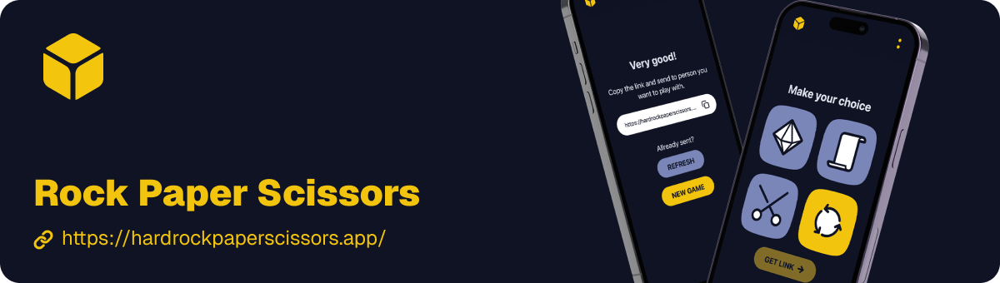

[](https://hardrockpaperscissors.app/)

# Rock Paper Scissors - Interactive Game

This is an interactive Rock Paper Scissors game built with Next.js and deployed online.

**Play the game live:** <a href="https://hardrockpaperscissors.app/" target="_blank" rel="noopener noreferrer">https://hardrockpaperscissors.app/</a>

You have only to make your choise and send the link to your friend!

## Back End

[Hard Rock Paper Scissors](https://www.val.town/x/hypersnob/HardRockPaperScissors/code/gameAPI) on [val.town](https://www.val.town)

## Getting Started Locally

To get a local copy up and running, follow these simple steps.

### Prerequisites

- Node.js (v18 or later recommended)
- pnpm package manager
  ```sh
  pnpm install -g pnpm
  ```

### Installation

1.  Clone the repo
    ```sh
    git clone https://github.com/hypersnob/rock-paper-scissors.git
    ```
2.  Install PNPM packages
    ```sh
    pnpm install
    ```
3.  Run the development server
    ```sh
    pnpm run dev
    ```

Open [http://localhost:3000](http://localhost:3000) with your browser to see the result.

## Building the Project

To create a production build, run:

```bash
pnpm build
```

## Front End Tech Stack

- [Next.js](https://nextjs.org/) - React Framework
- [TypeScript](https://www.typescriptlang.org/) - JavaScript Superset
- [Tailwind CSS](https://tailwindcss.com/) - CSS Framework (if applicable)

## Learn More about Next.js

To learn more about Next.js, take a look at the following resources:

- [Next.js Documentation](https://nextjs.org/docs) - learn about Next.js features and API.
- [Learn Next.js](https://nextjs.org/learn) - an interactive Next.js tutorial.

## Deploy on Vercel

The easiest way to deploy your Next.js app is to use the [Vercel Platform](https://vercel.com/new?utm_medium=default-template&filter=next.js&utm_source=create-next-app&utm_campaign=create-next-app-readme) from the creators of Next.js.

Check out the [Next.js deployment documentation](https://nextjs.org/docs/app/building-your-application/deploying) for more details.
